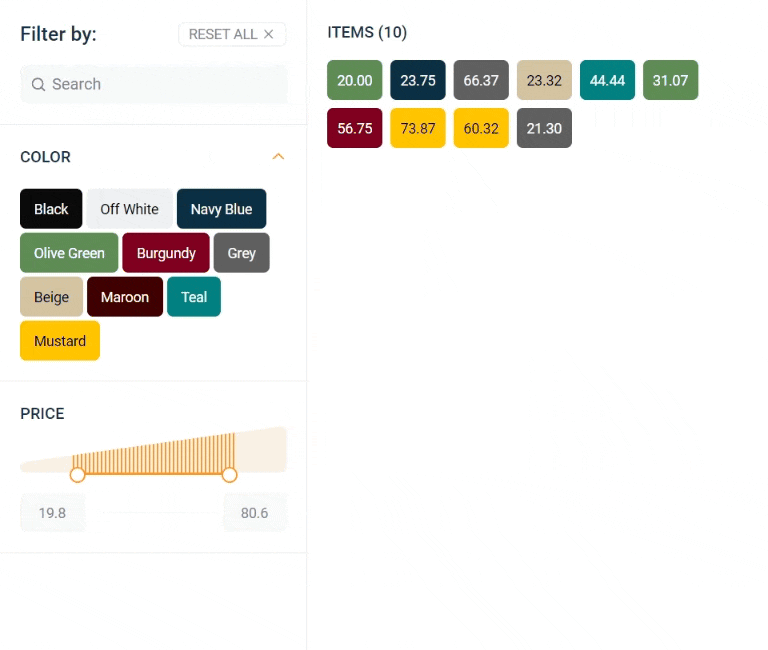
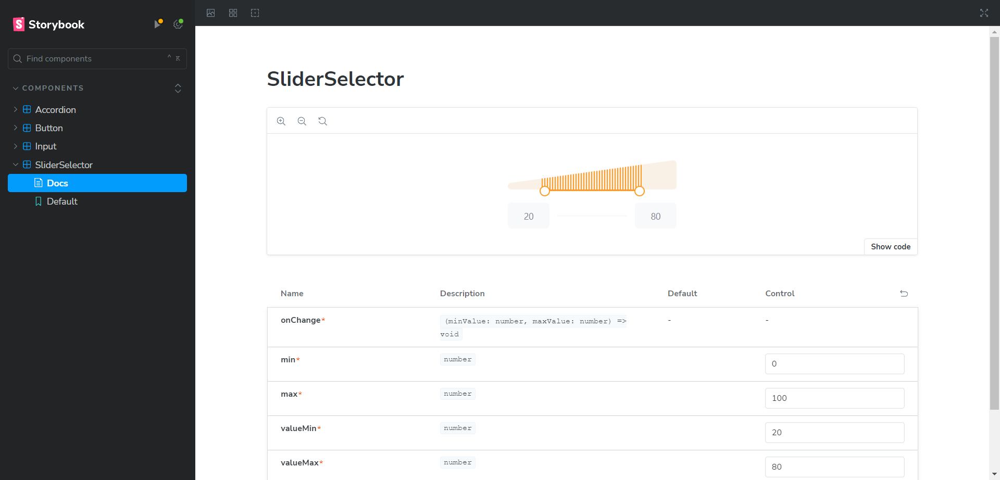
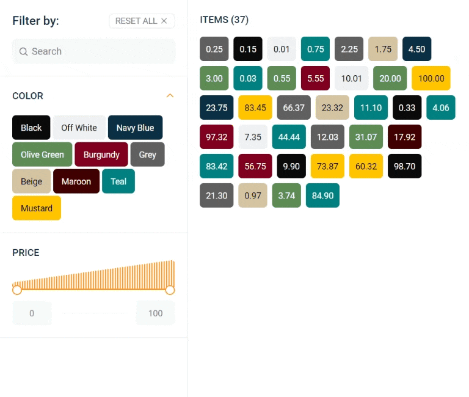
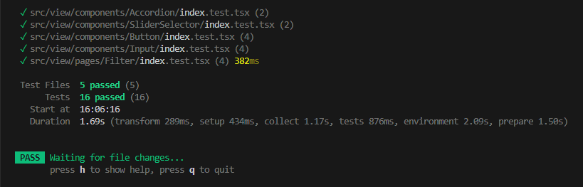
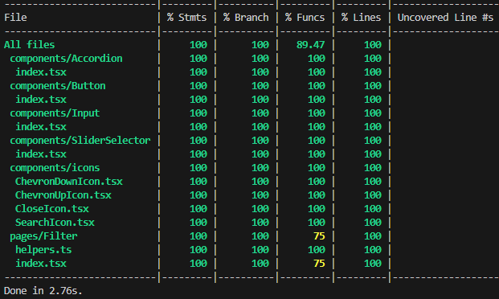

# Frontend Challenger Filter Screen

React application developed with  +  +  + 

### Go to [Live site](https://promo-movies.netlify.app)



## Getting Started

First, install the project dependencies:

```bash
yarn install
```

Then, run the development server:

```bash
yarn dev
```

A new tab will open on your browser in [http://localhost:5173](http://localhost:5173)

## Run storybook

Run storybook server with following command:

```bash
yarn storybook
```

A new tab will open on your browser in [http://localhost:6006/](http://localhost:6006/)



## How to interact with filters

A brief documentation outlining how to interact with the filter functionality

- ### Search filter:



#### Code:

```js
<Input
  name="search"
  placeholder="Search"
  icon={<SearchIcon />}
  value={searchFilter}
  onClear={() => setSearchFilter('')}
  onChange={(event) => setSearchFilter(event.target.value)}
/>
```

#### Explanation:

With this filter the user can search for specific items based on their prices.

- ### Colors filter:


#### Code:

```js
<Accordion
  title="COLOR"
  content={
    <ColorAccordionContent
      activeFilterColor={selectedFilterColor}
      onSelectColor={setSelectedFilterColor}
    />
  }
/>
```

#### Explanation:

With this filter the user can filter items by specific color. If the user click on the active color filter, the items list will show all items. This component receives the following props:

- `activeFilterColor` wich reflect the current selected color;
- `onSelectColor` which is the callback triggered when the user select a filter color.

- ### SliderSelector filter:


#### Code:

```js
<SliderSelector
  min={0}
  max={100}
  valueMin={priceRangeFilter.min}
  valueMax={priceRangeFilter.max}
  onChange={(min, max) => setPriceRangeFilter({ min, max })}
/>
```

#### Explanation:

With this filter the user can filter items by specific range of prices. The items list is updated instantly when user change the filter range value. This component receives the following props:

- `min` and `max` which will determine the minimum and maximum range of values;
- `valueMin` and `valueMax` which reflect the range selected by the user;
- `onChange` which is the callback triggered when the user changes the range of values.

## Run tests

To run unit tests, use the following command:

```bash
yarn test
```



To get coverage, run:

```bash
yarn coverage
```


